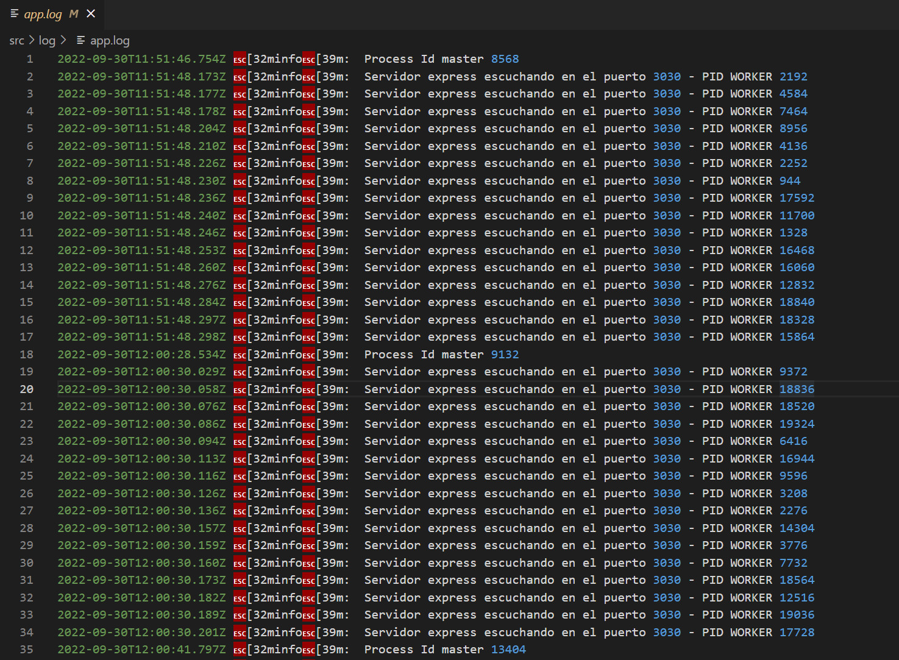
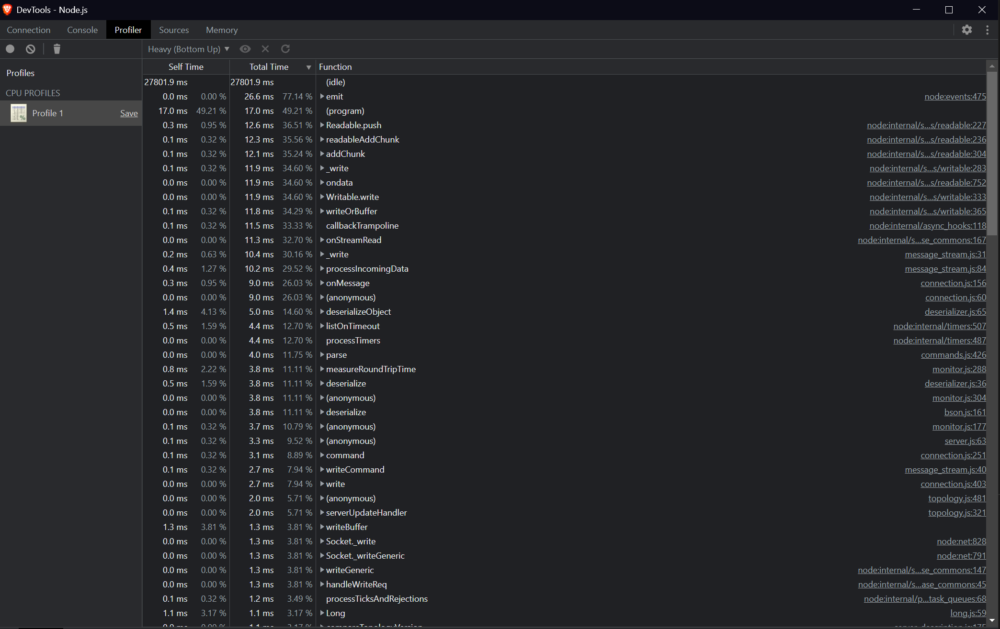

# CoderBackend

## Desafio entregable n° 15 - LOGGERS, GZIP y ANÁLISIS DE PERFORMANCE
- **Formato:** link a un repositorio en Github con el proyecto cargado.

- **Sugerencia:** no incluir los node_modules

- **Consigna:**
Incorporar al proyecto de servidor de trabajo la compresión gzip.
Verificar sobre la ruta /info con y sin compresión, la diferencia de cantidad de bytes devueltos en un
caso y otro.

Luego implementar loggueo (con alguna librería vista en clase) que registre lo siguiente:

● Ruta y método de todas las peticiones recibidas por el servidor (info)
● Ruta y método de las peticiones a rutas inexistentes en el servidor (warning)
● Errores lanzados por las apis de mensajes y productos, únicamente (error)

Considerar el siguiente criterio:

● Loggear todos los niveles a consola (info, warning y error)
● Registrar sólo los logs de warning a un archivo llamada warn.log
● Enviar sólo los logs de error a un archivo llamada error.log

Luego, realizar el análisis completo de performance del servidor con el que venimos
trabajando.

Vamos a trabajar sobre la ruta '/info', en modo fork, agregando ó extrayendo un console.log de la
información colectada antes de devolverla al cliente. Además desactivaremos el child_process de la ruta '/randoms'

Para ambas condiciones (con o sin console.log) en la ruta '/info' OBTENER:

1) El perfilamiento del servidor, realizando el test con --prof de node.js. Analizar los resultados obtenidos
luego de procesarlos con --prof-process.
Utilizaremos como test de carga Artillery en línea de comandos, emulando 50 conexiones concurrentes con
20 request por cada una. Extraer un reporte con los resultados en archivo de texto.

Luego utilizaremos Autocannon en línea de comandos, emulando 100 conexiones concurrentes realizadas
en un tiempo de 20 segundos. Extraer un reporte con los resultados (puede ser un print screen de la consola)

2) El perfilamiento del servidor con el modo inspector de node.js --inspect. Revisar el tiempo de los procesos
menos performantes sobre el archivo fuente de inspección.

3) El diagrama de flama con 0x, emulando la carga con Autocannon con los mismos parámetros anteriores.
Realizar un informe en formato pdf sobre las pruebas realizadas incluyendo los resultados de todos los test (texto e imágenes).

Al final incluir la conclusión obtenida a partir del análisis de los datos.


## Resolucion consigna:

Incorporar al proyecto de servidor de trabajo la compresión gzip. Verificar sobre la ruta /info con y sin compresión:

**● Prueba del endpoint sin compresión:** http://localhost:3030/info

**● Prueba del endpoint con gzip:** http://localhost:3030/info/gzip

Resultado:
```console
GET /info      200 1.552 ms 
GET /info/gzip 200 1.249 ms 

```

**Incorporar log (estos se encuentran en carpeta src/log):**


**Pruebas con Artillery:**

● Modo fork:
```console
npm run dev-fork
artillery quick -c 50 -n 20 "http://localhost:3030/info" > result_fork.txt
```

Resultado:
```console
--------------------------------
Summary report @ 14:24:03(-0300)
--------------------------------
http.codes.200: ................................................................ 1000
http.request_rate: ............................................................. 356/sec
http.requests: ................................................................. 1000
http.response_time:
  min: ......................................................................... 2
  max: ......................................................................... 56
  median: ...................................................................... 22
  p95: ......................................................................... 40
  p99: ......................................................................... 47.9
http.responses: ................................................................ 1000
vusers.completed: .............................................................. 50
vusers.created: ................................................................ 50
vusers.created_by_name.0: ...................................................... 50
vusers.failed: ................................................................. 0
vusers.session_length:
  min: ......................................................................... 208.1
  max: ......................................................................... 864.8
  median: ...................................................................... 632.8
  p95: ......................................................................... 854.2
  p99: ......................................................................... 854.2
```

● Modo cluster:  
```console
npm run dev-cluster
artillery quick -c 50 -n 20 "http://localhost:3030/info" > result_cluster.txt
```

Resultado:
```console  
--------------------------------
Summary report @ 14:36:56(-0300)
--------------------------------
http.codes.200: ................................................................ 1000
http.request_rate: ............................................................. 330/sec
http.requests: ................................................................. 1000
http.response_time:
  min: ......................................................................... 3
  max: ......................................................................... 66
  median: ...................................................................... 24.8
  p95: ......................................................................... 47.9
  p99: ......................................................................... 59.7
http.responses: ................................................................ 1000
vusers.completed: .............................................................. 50
vusers.created: ................................................................ 50
vusers.created_by_name.0: ...................................................... 50
vusers.failed: ................................................................. 0
vusers.session_length:
  min: ......................................................................... 225.4
  max: ......................................................................... 1013.1
  median: ...................................................................... 772.9
  p95: ......................................................................... 1002.4
  p99: ......................................................................... 1002.4
```

**Pruebas con PROFILING:**

```console
npm run dev-prof
artillery quick -c 50 -n 20 "http://localhost:3030/info" > artillery_prof.txt  
```

Luego renombre uno de los archivos "isolate-XXXX-v8-XXXX.log" a prof-v8.log, para convertir a legible el log

```console
node --prof-process prof-v8.log > prof_slow.txt
```

Resultado:
```console
Statistical profiling result from prof-v8.log, (3370 ticks, 0 unaccounted, 0 excluded).

[Shared libraries]:
  ticks  total  nonlib   name
  3240   96.1%          C:\Windows\SYSTEM32\ntdll.dll
  128    3.8%          C:\Program Files\nodejs\node.exe

[JavaScript]:
  ticks  total  nonlib   name
    1    0.0%   50.0%  LazyCompile: *resolve node:path:158:10
    1    0.0%   50.0%  Function: ^handleErrorFromBinding node:internal/fs/utils:341:32

[C++]:
  ticks  total  nonlib   name

[Summary]:
  ticks  total  nonlib   name
    2    0.1%  100.0%  JavaScript
    0    0.0%    0.0%  C++
    4    0.1%  200.0%  GC
  3368   99.9%          Shared libraries

[C++ entry points]:
  ticks    cpp   total   name

[Bottom up (heavy) profile]:
Note: percentage shows a share of a particular caller in the total
amount of its parent calls.
Callers occupying less than 1.0% are not shown.

  ticks parent  name
  3240   96.1%  C:\Windows\SYSTEM32\ntdll.dll

  128    3.8%  C:\Program Files\nodejs\node.exe
  105   82.0%    C:\Program Files\nodejs\node.exe
    36   34.3%      Function: ^compileFunction node:vm:308:25
    36  100.0%        Function: ^wrapSafe node:internal/modules/cjs/loader:1017:18
    36  100.0%          Function: ^Module._compile node:internal/modules/cjs/loader:1059:37
    36  100.0%            Function: ^Module._extensions..js node:internal/modules/cjs/loader:1114:37
    13   12.4%      Function: ^realpathSync node:fs:2425:22
    10   76.9%        Function: ^toRealPath node:internal/modules/cjs/loader:393:20
    9   90.0%          Function: ^tryFile node:internal/modules/cjs/loader:384:17
    6   66.7%            Function: ^tryExtensions node:internal/modules/cjs/loader:400:23
    2   22.2%            Function: ^tryPackage node:internal/modules/cjs/loader:338:20
    1   11.1%            LazyCompile: ~tryPackage node:internal/modules/cjs/loader:338:20
    1   10.0%          Function: ^Module._findPath node:internal/modules/cjs/loader:494:28
    1  100.0%            Function: ^Module._resolveFilename node:internal/modules/cjs/loader:848:35
    2   15.4%        LazyCompile: ~finalizeResolution node:internal/modules/esm/resolve:397:28
    2  100.0%          Function: ^moduleResolve node:internal/modules/esm/resolve:988:23
    2  100.0%            LazyCompile: ~defaultResolve node:internal/modules/esm/resolve:1128:30
    1    7.7%        LazyCompile: ~toRealPath node:internal/modules/cjs/loader:393:20
    1  100.0%          LazyCompile: ~tryFile node:internal/modules/cjs/loader:384:17
    1  100.0%            LazyCompile: ~tryExtensions node:internal/modules/cjs/loader:400:23
    11   10.5%      Function: ^stat node:internal/modules/cjs/loader:151:14
    7   63.6%        Function: ^tryFile node:internal/modules/cjs/loader:384:17
    7  100.0%          Function: ^tryExtensions node:internal/modules/cjs/loader:400:23
    7  100.0%            Function: ^Module._findPath node:internal/modules/cjs/loader:494:28
    4   36.4%        Function: ^Module._findPath node:internal/modules/cjs/loader:494:28
    4  100.0%          Function: ^Module._resolveFilename node:internal/modules/cjs/loader:848:35
    4  100.0%            Function: ^Module._load node:internal/modules/cjs/loader:757:24
    5    4.8%      Function: ^compileForInternalLoader node:internal/bootstrap/loaders:299:27
    5  100.0%        Function: ^nativeModuleRequire node:internal/bootstrap/loaders:332:29
    2   40.0%          Function: ~<anonymous> node:http:1:1
    2  100.0%            Function: ^compileForInternalLoader node:internal/bootstrap/loaders:299:27
    1   20.0%          Function: ~<anonymous> node:internal/process/esm_loader:1:1
    1  100.0%            Function: ^compileForInternalLoader node:internal/bootstrap/loaders:299:27
    1   20.0%          Function: ~<anonymous> node:internal/modules/esm/loader:1:1
    1  100.0%            Function: ^compileForInternalLoader node:internal/bootstrap/loaders:299:27
    1   20.0%          Function: ~<anonymous> node:internal/crypto/hkdf:1:1
    1  100.0%            Function: ^compileForInternalLoader node:internal/bootstrap/loaders:299:27
    3    2.9%      Function: ^read node:internal/modules/package_json_reader:16:14
    2   66.7%        Function: ^readPackage node:internal/modules/cjs/loader:290:21
    2  100.0%          Function: ^resolveExports node:internal/modules/cjs/loader:472:24
    2  100.0%            Function: ^Module._findPath node:internal/modules/cjs/loader:494:28
    1   33.3%        LazyCompile: ~readPackage node:internal/modules/cjs/loader:290:21
    1  100.0%          LazyCompile: ~resolveExports node:internal/modules/cjs/loader:472:24
    1  100.0%            LazyCompile: ~Module._findPath node:internal/modules/cjs/loader:494:28
    3    2.9%      C:\Program Files\nodejs\node.exe
    1   33.3%        LazyCompile: ~resolvePackageTargetString node:internal/modules/esm/resolve:507:36
    1  100.0%          LazyCompile: ~resolvePackageTarget node:internal/modules/esm/resolve:572:30
    1  100.0%            LazyCompile: ~resolvePackageTarget node:internal/modules/esm/resolve:572:30
    1   33.3%        Function: ^deprecate node:internal/util:96:19
    1  100.0%          Function: ~<anonymous> node:tls:1:1
    1  100.0%            Function: ^compileForInternalLoader node:internal/bootstrap/loaders:299:27
    1   33.3%        Function: ^FastBuffer node:internal/buffer:958:14
    1  100.0%          Function: ^createUnsafeBuffer node:internal/buffer:1059:28
    1  100.0%            LazyCompile: ~allocate node:buffer:398:18
    2    1.9%      LazyCompile: ~compileForInternalLoader node:internal/bootstrap/loaders:299:27
    2  100.0%        LazyCompile: ~nativeModuleRequire node:internal/bootstrap/loaders:332:29
    1   50.0%          Function: ~<anonymous> node:internal/main/run_main_module:1:1
    1   50.0%          Function: ~<anonymous> node:internal/child_process:1:1
    1  100.0%            LazyCompile: ~compileForInternalLoader node:internal/bootstrap/loaders:299:27
    2    1.9%      LazyCompile: ~Resolver node:internal/dns/utils:53:14
    2  100.0%        Function: ~<anonymous> node:internal/dns/utils:1:1
    2  100.0%          Function: ^compileForInternalLoader node:internal/bootstrap/loaders:299:27
    2  100.0%            Function: ^nativeModuleRequire node:internal/bootstrap/loaders:332:29
    2    1.9%      Function: ^closeSync node:fs:526:19
    2  100.0%        Function: ^readFileSync node:fs:450:22
    2  100.0%          Function: ^Module._extensions..js node:internal/modules/cjs/loader:1114:37
    2  100.0%            Function: ^Module.load node:internal/modules/cjs/loader:969:33
    2    1.9%      Function: ^URL node:internal/url:621:14
    1   50.0%        Function: ^defaultGetFormatWithoutErrors node:internal/modules/esm/get_format:103:39
    1  100.0%          Function: ^defaultResolve node:internal/modules/esm/resolve:1128:30
    1  100.0%            Function: ^resolve node:internal/modules/esm/loader:556:16
    1   50.0%        Function: ^URL node:internal/url:621:14
    1  100.0%          Function: ^getPackageScopeConfig node:internal/modules/esm/resolve:253:31
    1  100.0%            Function: ^getPackageType node:internal/modules/esm/resolve:848:24
    2    1.6%    Function: ^Module.require node:internal/modules/cjs/loader:997:36
    2  100.0%      Function: ^require node:internal/modules/cjs/helpers:101:31
    1   50.0%        Function: ~<anonymous> D:\Dev\Coderhouse\Coderbackend-31020\Desafio15\node_modules\ws\index.js:1:1
    1  100.0%          Function: ^Module._compile node:internal/modules/cjs/loader:1059:37
    1  100.0%            Function: ^Module._extensions..js node:internal/modules/cjs/loader:1114:37
    1   50.0%        Function: ~<anonymous> D:\Dev\Coderhouse\Coderbackend-31020\Desafio15\node_modules\whatwg-url\webidl2js-wrapper.js:1:1
    1  100.0%          Function: ^Module._compile node:internal/modules/cjs/loader:1059:37
    1  100.0%            Function: ^Module._extensions..js node:internal/modules/cjs/loader:1114:37
```

**Pruebas con AUTOCANNON:**

agregá dos scripts en package.json:
```console
"dev-test": "node ./src/utils/benchmark.util.js -p 3030",
"dev-start": "0x ./src/server.js",
"dev-inspect": "node --inspect ./src/server.js -p 3030"	
```

● dev-test:
```console
	npm run dev-test.
```

resultado:
```console	
Running 20s test @ http://localhost:3030/info
100 connections

┌─────────┬──────┬──────┬───────┬──────┬──────┬───────┬──────┐
│ Stat    │ 2.5% │ 50%  │ 97.5% │ 99%  │ Avg  │ Stdev │ Max  │
├─────────┼──────┼──────┼───────┼──────┼──────┼───────┼──────┤
│ Latency │ 0 ms │ 0 ms │ 0 ms  │ 0 ms │ 0 ms │ 0 ms  │ 0 ms │
└─────────┴──────┴──────┴───────┴──────┴──────┴───────┴──────┘
┌───────────┬─────┬──────┬─────┬───────┬─────┬───────┬─────┐  
│ Stat      │ 1%  │ 2.5% │ 50% │ 97.5% │ Avg │ Stdev │ Min │  
├───────────┼─────┼──────┼─────┼───────┼─────┼───────┼─────┤  
│ Req/Sec   │ 0   │ 0    │ 0   │ 0     │ 0   │ 0     │ 0   │  
├───────────┼─────┼──────┼─────┼───────┼─────┼───────┼─────┤  
│ Bytes/Sec │ 0 B │ 0 B  │ 0 B │ 0 B   │ 0 B │ 0 B   │ 0 B │  
└───────────┴─────┴──────┴─────┴───────┴─────┴───────┴─────┘  

Req/Bytes counts sampled once per second.
# of samples: 20

171k requests in 20.08s, 0 B read
171k errors (0 timeouts)	
```	
	
● dev-start:
```console
	npm run dev-start.
```


● dev-inspect:
```console
	npm run dev-inspect.
```
